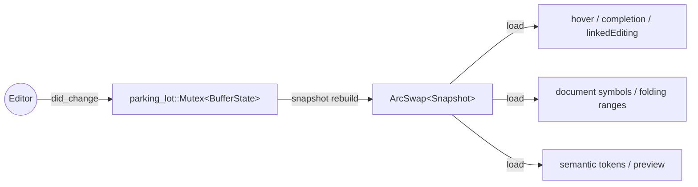

# State model

Per-document state lives inside [`DocState`], keyed by document URI
in an `Arc<DashMap<Url, Arc<DocState>>>` on the backend. DashMap
gives bucket-level concurrent access without a global lock; each
document's own concurrency story is described below.

## The split

`DocState` separates writers from readers along the lock axis:



- **`BufferState`** (mutex-guarded) — the writer-side state. Holds a
  `Vec<MutParagraph>`, a single `tree_sitter::Parser` shared across
  paragraphs, and a `SegmentCache` for the semantic re-parse output.
  Only the `did_change` / `did_open` / `did_close` handlers acquire
  this mutex.
- **`Snapshot`** (`ArcSwap`-held) — the reader-side state. Carries
  `Arc<[Arc<ParagraphSnapshot>]>` plus a binary-searchable
  `paragraph_starts: Arc<[u32]>`, the document's `total_bytes`, the
  monotonically-increasing `version: u64`, and three `OnceLock`-cached
  doc-wide views (concatenated text, `LineIndex`, gaiji-span map).
  Every read handler resolves the snapshot with a single
  `arc_swap.load_full()` — wait-free under contention.

The mutex is `parking_lot::Mutex`, not `std::sync::Mutex`. The `std`
mutex propagates poisoning every time it is acquired, which is noise
on a writer-only mutex held purely around in-memory paragraph
mutation; `parking_lot` is also a few percent faster on contention.

## Paragraph-first

`BufferState` does not hold one big rope and one document-wide
tree-sitter `Tree`. It holds a `Vec<MutParagraph>`, where each
`MutParagraph` owns its own `Rope` text and `Option<Tree>`. The
document is split at `\n\n` boundaries by `paragraph_byte_ranges`,
with a 64 KiB hard cap (`MAX_PARAGRAPH_BYTES`) when no blank line
appears in a long stretch.

The reason is operational. Tree-sitter's parse on the aozora grammar
is `O(doc-size)` (~33 ns/byte on the corpus benchmark), so a single
document-wide reparse on a 6 MB document costs about 220 ms — too
slow for keystroke responsiveness. Splitting the buffer into
paragraphs and reparsing only the paragraph the edit hits caps the
per-keystroke parse cost at the paragraph size, typically a few
hundred bytes to a few KB.

Edit flow:

1. `BufferState::apply_edits` validates the edit batch (in-bounds,
   char-boundary aligned, sorted, non-overlapping).
2. For each edit, `locate_byte` resolves the doc-absolute byte to
   `(paragraph_idx, paragraph_local_byte)`.
3. Within-paragraph edits go through `apply_within_paragraph` →
   `MutParagraph::apply_edit` with a paragraph-local `InputEdit`,
   reparsing only that paragraph through `Parser::parse_with_options`.
4. Cross-paragraph edits build a merged rope, re-segment with
   `paragraph_byte_ranges`, and splice the new `MutParagraph` list
   in place via `Vec::splice`.
5. Oversized paragraphs (post-edit > `MAX_PARAGRAPH_BYTES`) trigger
   an in-place re-segment via `maybe_resegment_around`.

## Snapshot rebuild reuse

Because writers update paragraphs individually, the read-side
`Snapshot` rebuild can reuse paragraphs that did not change. For each
paragraph index in the new buffer, `build_snapshot` checks whether
the prior snapshot's same-index paragraph has the same
`Tree::root.id()` and the same byte length. If both match,
`ParagraphSnapshot::shifted_to` returns either an `Arc::clone` of the
prior snapshot (no shift, pure pointer bump) or a new outer
`Arc<ParagraphSnapshot>` whose `text` / `line_index` / `tree` fields
are inner-`Arc`-shared with the prior, with only the gaiji span
list rebuilt to carry shifted doc-absolute offsets.

Net effect: an edit that touches paragraph *K* leaves the other
*N* − 1 paragraphs to be reused via single atomic increments. The
full snapshot rebuild work is `O(1 paragraph rebuilt + (N − 1)
Arc bumps)`, regardless of document size.

Doc-wide views (`Snapshot::doc_text`, `doc_line_index`,
`doc_gaiji_spans`) are lazily materialised via `OnceLock` on first
access, so handlers that iterate paragraphs directly skip the
`O(text-size)` materialisation entirely.

## Why `Document` is not stored

`aozora::Document` owns a `bumpalo::Bump` whose interior cells make
it `!Sync`. `DocState` lives inside `Arc<DashMap<…>>`, which requires
`Sync`, so a `Document` cannot be stashed inside the state.

The `SegmentCache` instead holds the latest semantic diagnostics
(`Vec<aozora::Diagnostic>`) and re-parses on demand whenever a
request handler needs the borrowed `AozoraTree`:

```rust
pub fn with_tree<R>(&self, f: impl FnOnce(&AozoraTree<'_>) -> R) -> Option<R>;
```

The closure runs while the parsed tree is in scope; the arena drops
when the closure returns. Re-parse cost is paid per call, but the
semantic parser's borrowed-arena pipeline absorbs a multi-MB
document in single-digit milliseconds — well below the
keystroke-perceptibility threshold for the consumers that hit this
path (formatting, code actions, the renderHtml preview).

## Semantic vs syntactic parsers

Two parsers run side by side, dividing labour by request frequency
and required precision:

| Parser | Used by | Granularity |
|---|---|---|
| **tree-sitter** (per-paragraph, kept in `MutParagraph`) | hover / completion / linkedEditingRange / semanticTokens / `aozora/gaijiSpans` / inlay extraction | structural-only — gaiji spans, ruby spans, container nesting; no diagnostics |
| **`aozora` semantic parser** (run on demand against the snapshot text) | `textDocument/publishDiagnostics`, `textDocument/formatting`, `aozora/renderHtml`, `textDocument/codeAction` quick-fix payloads | full — gaiji resolution, slug catalogue, kaeriten linking, structured diagnostics |

High-frequency handlers stay on the structural-only fast path; the
semantic source of truth lives one debounce hop behind.

## The 150 ms debounce

`did_change` does the fast work synchronously: validate the edit
batch, mutate each affected paragraph's `Rope`, apply the
paragraph-local tree-sitter `InputEdit`, bump `edit_version`, and
spawn the snapshot rebuild onto `tokio::task::spawn_blocking`. Then
`Backend::schedule_publish_debounced` records the current
`edit_version` as `target_version` and spawns a
`tokio::time::sleep(150 ms)` task.

When the timer fires, the task re-checks the doc's `edit_version`
against the value it captured at scheduling time.

- **Newer version observed** — a later edit has scheduled its own
  debounced task; this one bails silently.
- **Same version** — the user has stopped typing. The task clones the
  snapshot's `doc_text()` into a `spawn_blocking` body, runs
  `aozora::Document::new(text).parse().diagnostics()`, re-checks the
  version once more (a parse that just missed the cutoff must not
  overwrite a newer one), installs the diagnostics into the
  `SegmentCache`, and publishes them through the LSP client.

A 100-keystroke burst therefore produces **exactly one** semantic
re-parse and one `publishDiagnostics` notification — the one whose
target version matches the post-burst state. The `PUBLISH_DEBOUNCE_MS`
constant lives in `crate::backend`; tests that drive a synchronous
re-parse without an async runtime call `DocState::run_segment_cache_reparse`
directly.

## Concurrency invariants

The `aozora-lsp` test suite includes a randomised concurrency checker
driven by the [`shuttle`](https://docs.rs/shuttle) crate behind the
`shuttle-tests` feature. It explores arbitrary interleavings of two
threads operating on a shared
`Arc<Mutex<HashMap<Url, Arc<Mutex<ShuttleDoc>>>>>` and asserts that:

- The cached `parsed_state_proxy(text)` value of every live document
  matches a fresh re-derivation, regardless of the schedule.
- Worker threads never panic.
- The schedule never deadlocks.

Run the checker with:

```sh
cargo test -p aozora-lsp --features shuttle-tests --test shuttle_doc_state
```

Without the feature flag the test compiles to a no-op and the shuttle
dependency is not pulled in. The CI coverage job runs with
`--all-features`, so the checker exercises 1,000 random schedules on
every PR; nightly cron raises `AOZORA_SHUTTLE_ITERS` higher.

For the standard `did_change` invariants — snapshot version
monotonicity, `total_bytes` matching `doc_text().len()` under
contention, and panic resistance across the public LSP surface — see
the property and guardian suites in `crates/aozora-lsp/tests/`.
