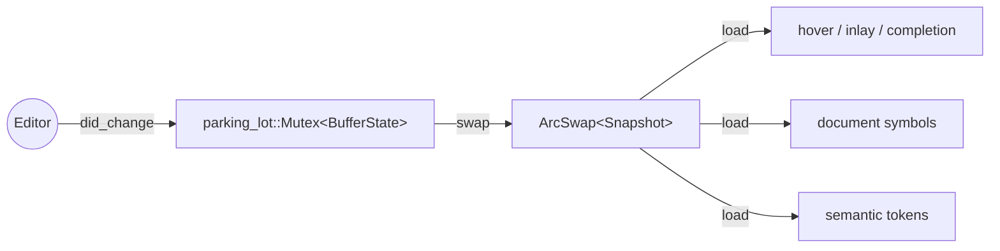

# State model

Per-document state lives inside a `DocState`, keyed by the document
URI in an `Arc<DashMap<Url, Arc<DocState>>>` on the backend. The
DashMap gives concurrent access without a global lock; a per-document
state needs its own concurrency story.

## The split

`DocState` is split along the read/write axis:



- **`BufferState`** (mutex-guarded) — the writer-side state. Holds
  the rope buffer (`ropey::Rope`), the tree-sitter `Tree`, and the
  edit-version counter. Only the `did_change` / `did_open` /
  `did_close` handlers acquire this mutex.
- **`Snapshot`** (`ArcSwap`-held) — the reader-side state. Holds an
  immutable copy of the buffer's textual contents plus the latest
  diagnostics published to the editor. Every read handler resolves
  it with a single `arc_swap.load()` — wait-free under contention.

The mutex is `parking_lot::Mutex` rather than `std::sync::Mutex` for
two reasons: `std::sync::Mutex` propagates poisoning every time it
is acquired, which adds noise on a writer-only mutex held purely
around in-memory text mutation; and `parking_lot` is a few percent
faster on contention. Neither argument is decisive on its own; the
poisoning ergonomics tip the balance.

## Why `Document` is not stored

`aozora::Document` owns a `bumpalo::Bump` whose interior cells make
it `!Sync`. `DocState` lives inside `Arc<DashMap<...>>` which
requires `Sync`, so a `Document` cannot be stashed inside the
state.

The `SegmentCache` instead holds the raw text and re-parses on
demand whenever a request handler needs the borrowed `AozoraTree`:

```rust
pub fn with_tree<R>(&self, f: impl FnOnce(&AozoraTree<'_>) -> R) -> Option<R>;
```

The closure runs while the parsed tree is in scope; the arena drops
when the closure returns. Re-parse cost is paid per call, but the
v0.3.0 borrowed-arena pipeline absorbs a 6 MB document in single-
digit milliseconds, well below the keystroke-perceptibility
threshold.

## The 200 ms debounce

`did_change` does the *fast* work synchronously: text edit + tree-
sitter incremental update + version bump. The semantic re-parse
(diagnostics, document-symbol cache invalidation, segment-count
metric) is scheduled into a `tokio::task::spawn_blocking` task with
a 200 ms timer. Subsequent `did_change` events within the window
reset the timer — so a typing burst causes one re-parse at the end,
not one per keystroke.

When the timer fires, the task acquires the mutex briefly to read
the latest text into a stack buffer, drops the mutex, runs the
re-parse on the stack buffer, and atomically installs a new
`Snapshot` containing the new diagnostics. The mutex is held for
< 1 ms even on a 6 MB buffer; readers running concurrently see the
old snapshot until the swap.

## Concurrency invariants

The `aozora-lsp` test suite includes a randomised concurrency
checker driven by the [`shuttle`](https://docs.rs/shuttle) crate
behind the `shuttle` feature. It explores arbitrary interleavings
of multi-threaded `Arc<DashMap<Url, DocState>>` operations and
asserts that:

- A `Snapshot` load never observes torn state.
- The version counter is monotonic per document.
- The diagnostics published for version `v` were derived from the
  text at version `v` (no version skew).

Run the checker with:

```sh
cargo test --features shuttle --test shuttle_doc_state
```

Without the feature flag, the dependency is not pulled in.
