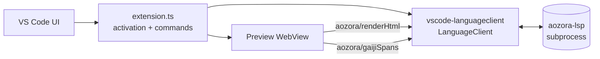

# Architecture

The VS Code extension lives in
[`editors/vscode/`](https://github.com/P4suta/aozora-tools/tree/main/editors/vscode).
It is a thin wrapper around `aozora-lsp`: spawn the server over
stdio, register the LSP client, add a preview WebView and a couple
of editor-specific commands.

## Component map



## Activation

- **Triggers**: `onLanguage:aozora` (any file matching the language
  configuration in `package.json` — `.afm`, `.aozora`,
  `.aozora.txt`).
- **Server lookup order**:
  1. `aozora-lsp.serverPath` setting (user-overridable absolute path).
  2. Bundled binary at `<extension>/server/aozora-lsp(.exe)` —
     present in published `.vsix` builds.
  3. `aozora-lsp` on `$PATH`.

The bundled-binary path is the one that fires on a Marketplace install;
the `serverPath` override exists for contributors running an unpublished
LSP build.

## Commands

| Command | Trigger | Action |
|---|---|---|
| `Aozora: Open Preview` | command palette / editor toolbar | Opens (or focuses) the preview WebView for the active editor. |
| `Aozora: Canonicalize Slug at Cursor` | command palette / Quick Fix | Sends `workspace/executeCommand` with the cursor position. The server's `aozora.canonicalizeSlug` handler does the rest. |

Both commands are no-ops outside an aozora document.

## Decoration types

The extension creates two LSP-driven decorations:

- **Inline gaiji folds** — fed by `aozora/gaijiSpans`. Each span's
  source bytes are folded down to the resolved character with a
  hover preview restoring the original `※［＃...］`.
- **Linked-edit highlight** — driven by the standard
  `textDocument/linkedEditingRange`; the editor's built-in
  decoration handles rendering.

## Build

```sh
cd editors/vscode
bun install --frozen-lockfile
bun run compile     # esbuild production bundle → out/extension.js
bun run check       # biome lint + tsc type-check (no writes)
```

The `compile` script bundles the TypeScript source into a single
`out/extension.js` that VS Code loads on activation. The bundle is
a CommonJS module (VS Code's extension host is Node, not ESM
runtime).

## Why bun

The repo uses [`bun`](https://bun.sh/) instead of npm / pnpm for
two reasons: it installs `node_modules/` in 1-2 seconds versus 30+
for npm on a cold cache, and `bun.lock` is the single lockfile (no
parallel `package-lock.json` / `pnpm-lock.yaml`). Lefthook's
`post-merge` and `post-checkout` hooks run `bun install
--frozen-lockfile` quietly so contributors are never out of sync
after a branch swap.
